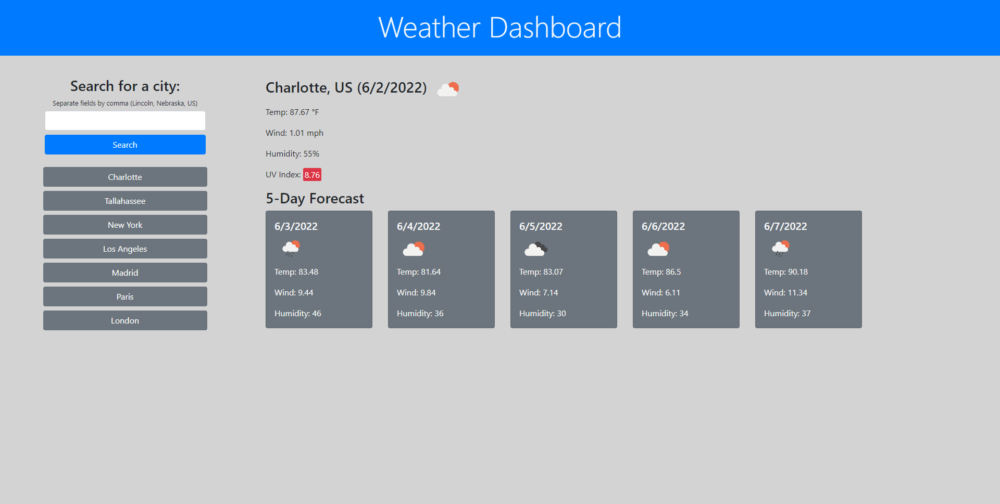
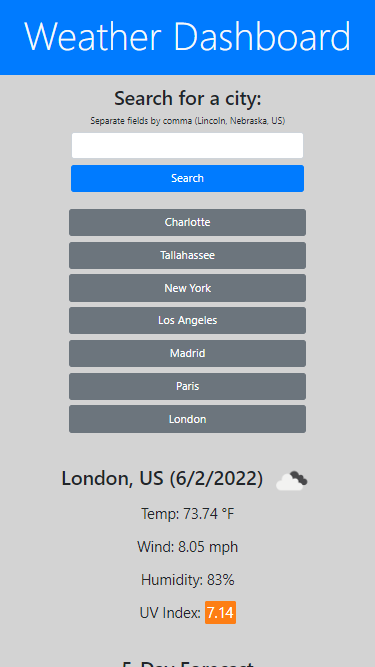
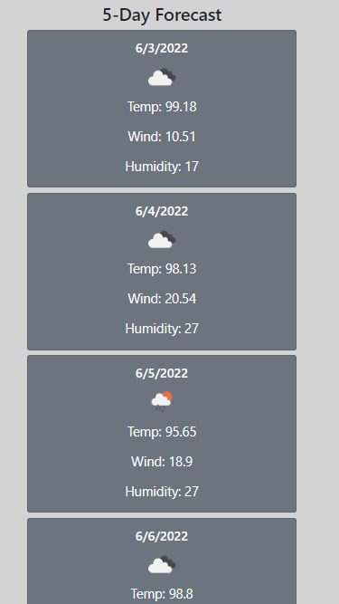

# Weather Dashboard

## Table of Contents
1. [Description](#description)
2. [Visuals](#visuals)
3. [Usage](#usage)
4. [Resources](#resources)

## Description
This is a website that allows the user to search for the current and 5-day forecast weather in a city. The design was an experiment in utilizing Bootstrap, and the functionality was an experiment in utilizing server-side apis and fetch requests. If the user sends an invalid search request, no results are found, or the request returns an error, the user will receive an alert notifying them of the error. The past 8 search results are saved in localStorage and set to quick search buttons for easy access. The most recent search will be refetched and display when the page is loaded.

## Usage
- On your first visit and after clearing localStorage, search for a city to display the current weather and a 5-day forecast for weather in that city
- You can keep searching for new cities, and the site will save your last 8 successful searches as quick access buttons

| Parameters                | Example          | Result               |
| :-----------------------: | :--------------: | :------------------: |
| City                      | London           | London, UK           |
| City, Country Code        | London, US       | London, Kentucky, US |
| City, State, Country Code | London, Ohio, US | London, Ohio, US     |
| Zip Code, Country Code    | 72847, US        | London, Arkansas, US |

## Visuals

## Resources
- [Live Site](https://jthefox.github.io/weather-dashboard/)
- [Online Repository](https://github.com/JtheFox/weather-dashboard)
- [OpenWeatherMap API](https://openweathermap.org/api)
